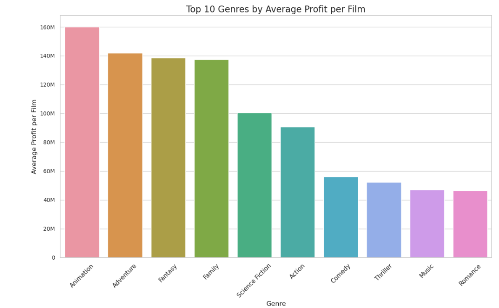
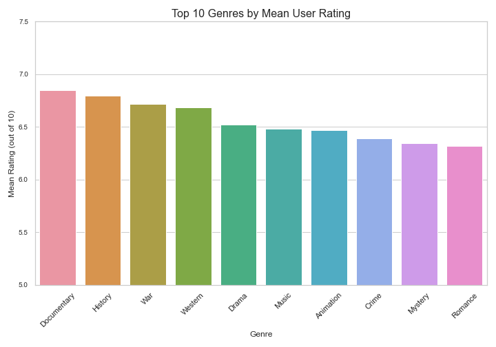
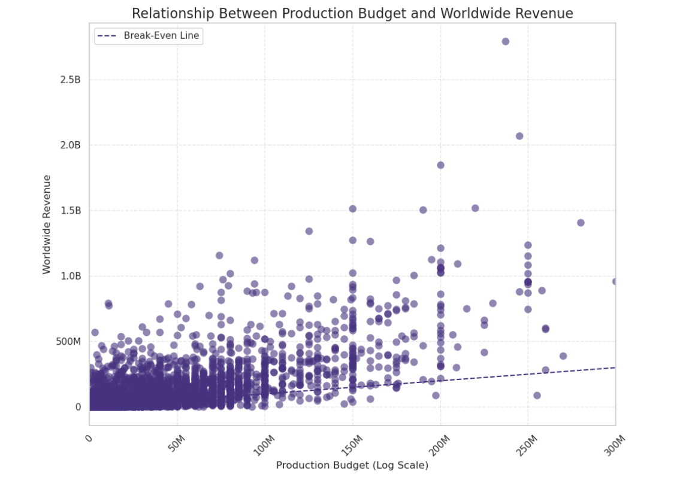
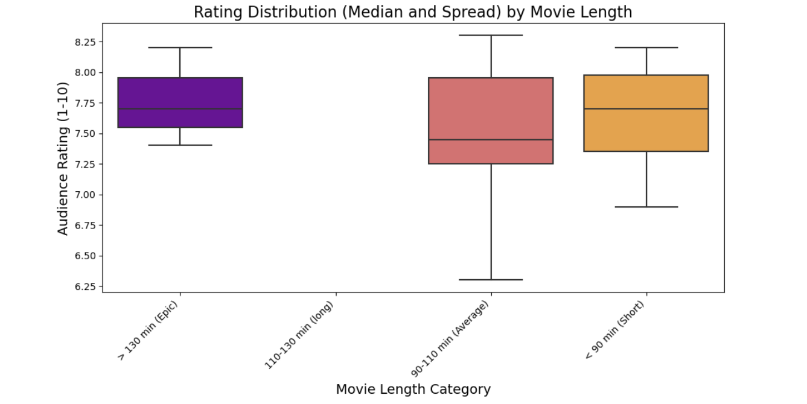
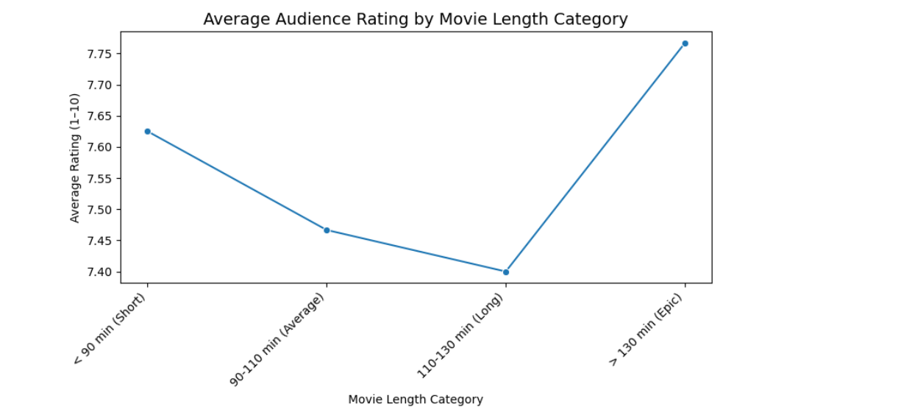
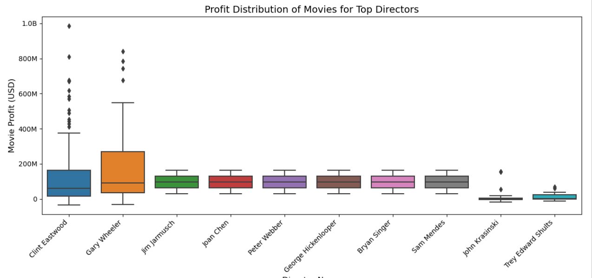
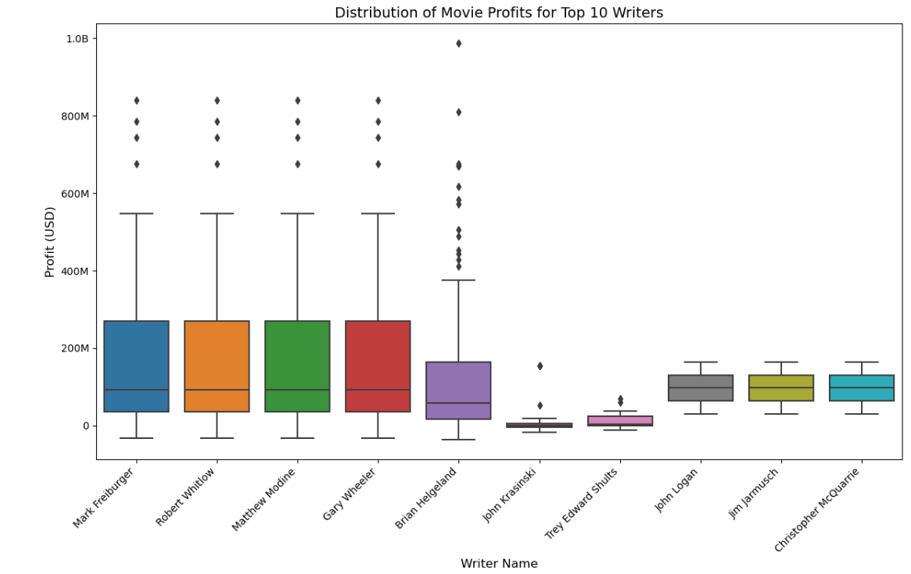
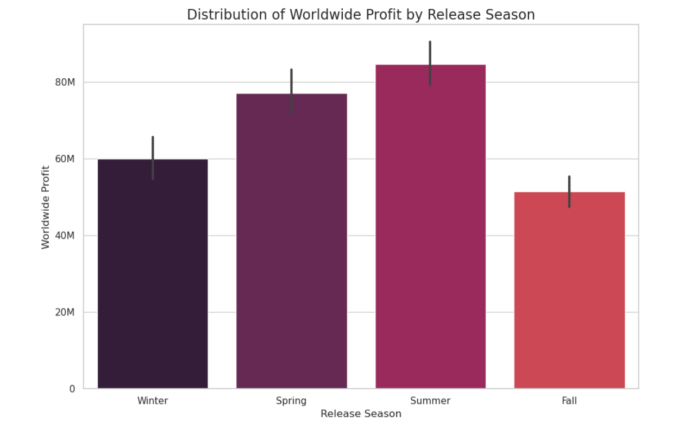

# PHASE2_GROUP3_PROJECT

## FILM INDUSTRY PERFORMANCE AND CONTRIBUTOR IMPACT ANALYSIS

### Overview
This project focuses on analyzing movie performance in the Entertainment and Media Sector to uncover patterns, trends and key drivers of commercial and critical success in the film industry.By examining the relationship between production budgets, revenues, genres, ratings, contributor roles (Directors and Writers), and release timing, this report provides insights that support strategic decision-making for film production planning and investment.

### Business Understanding
Producing a film involves financial risk. Studios must choose projects carefully to balance artistic goals with commercial success. This project addresses:

- Which **genres** generate the highest **revenue and profit**
- The role of **contributors** (directors, companies, cast) in film success
- Whether **higher budgets** actually lead to better performance
- How **length of movie/ runtime** affects box office results
- How **ratings** relate to commercial outcomes
- How **release timing / season** affects box office results

These insights support data-driven studios in key areas like content strategy, budgeting and talent planning by revealing how different production choices influence both profits and ratings.

### Data Understanding
The datasets used in this project are sourced from publicly available movie databases, including Box Office Mojo (BOM), The Numbers (TN), IMDB database and The Movie Database (TMDb).They provide structured information on thousands of films released over the past two decades.
The data spans multiple formats; categorical variables such as genre, director, and writer, numerical variables such as budget, gross revenue, and ratings and temporal variables such as release year and runtime.
The dataset includes:
- Film titles & release dates
- Genres (one or multiple per film)
- Production budget & box office revenue
- Ratings & popularity metrics
- Contributor data (directors,writers etc.)
- Movie runtime

### Data Preparation
To ensure reliable analysis, the following steps were performed:
- Merging of the datasets
- Cleaned inconsistent formatting and missing values
- Converted monetary values to numeric types
- Extracted and separated multiple genres per film
- Calculated profit and categorized release dates into seasons

### Key Visualizations & Insights

#### 1. Genre Performance
- Some genres consistently yielded **higher financial returns**.
- Genres with high viewer ratings do **not always** perform best financially.

#### 2. Budget vs Revenue
- Higher budgets **do not guarantee** higher revenue.

#### 3. Runtime vs Ratings
- Epic length movies (130+ minutes) have the highest average vote rating **suggesting a positive correlation** between runtime and audience ratings.

#### 5. Directors & Writers Successes
- Directors with a **consistent track record** of profitable films tend to influence a film’s commercial success
- Some directors have **recognizable creative work** that draw loyal audiences
- Writers with **successful films** tend to be known for depth and authenticity in scripts which always draw a loyal audience

#### 6. Seasonal Impact
- Films released during **Summer & Spring** generally perform better.
- Release timing is a **strategic success factor**.

### CONCLUSIONS
- Movie length vs audience ratings: The longer movies tend to be rated more favorably
- Directors and writers Vs Movie Performance: The directors generating high revenue to be considered for better returns.
- Genres effects on ratings, gross revenue and profit: Genres with high total profit are better options for studios aiming for consistent returns
- Movie realese season vs profit : Studios to prioritize Summer and Spring for major release to maximize revenue

### RECOMMENDATIONS
- Movie length vs audience ratings: Content creators to consider longer movie run times, they probably give an allowance for deeper story telling.

- Directors and writers Vs Movie Performance: The studio to consider prioritizing directors who have released movies that generated high revenues e.g Clint Eastwood and Gary Wheeler

- Genres effects on ratings, gross revenue and profit: The studios to consider prioritizing genres with high total profit for consistent returns

- Movie realese season vs profit : Seasonality should be considered in release planning and marketing strategies.

### Appendix
[Film Impact Presentation Slides (PDF)](Group3_presentation_slides.pdf)
[Film Analysis Notebook](movies.ipynb)
[Film Analysis Notebook(PDF)](movies.pdf)
[Film Data Report(PDF)](datareport.pdf)

##### Contributors
View our GitHub Pages site:   
[Lilibeth Langat]([https://github.com/lilibethlangat])
[Jeniffer Mbugua]([https://github.com/Jen-shiko])
[Lydia Khisa]([https://github.com/klydia22])
[Vicky Gakuo]([https://github.com/gakuovicky])